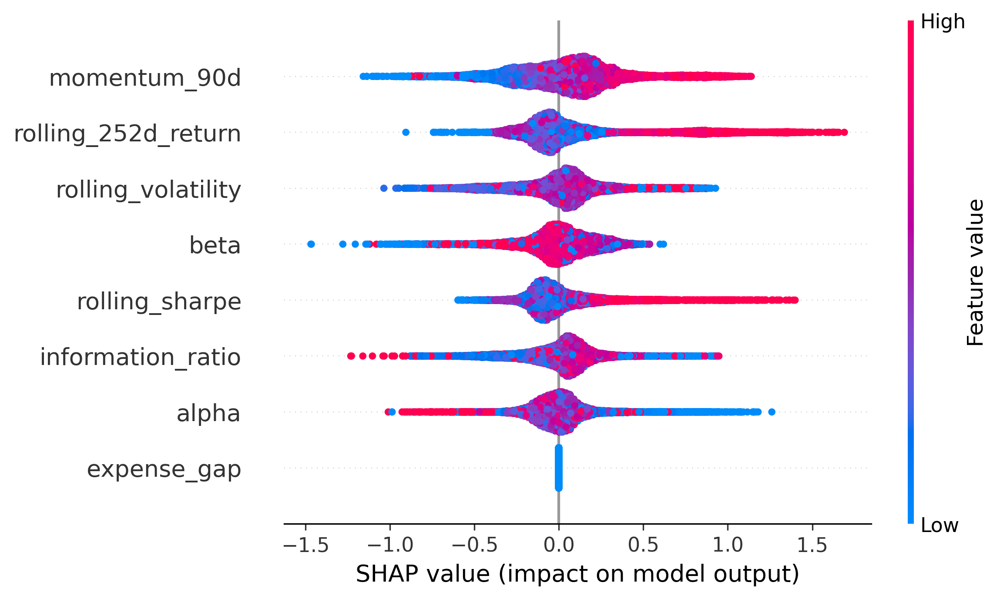

# CommissionLens — Commission-Adjusted Alpha Prediction in Mutual Funds

## Overview

CommissionLens is a financial machine learning project that evaluates whether Indian mutual fund commissions are economically justified.

Although regular and direct mutual fund plans invest in the same underlying portfolio under the same fund manager, regular plans charge higher expense ratios due to distributor commissions. Over long investment horizons, these additional costs compound significantly and may reduce investor wealth by several lakhs.

This project builds a complete quantitative framework to predict whether a mutual fund will generate sufficient future alpha to justify its commission cost.

The system combines:
- large-scale mutual fund NAV data,
- benchmark-adjusted performance metrics,
- rolling financial factor engineering,
- machine learning classification,
- SHAP explainability,
- SIP backtesting.

---

# Problem Statement

India has more than 90 million demat accounts, yet many investors remain unaware of the long-term impact of mutual fund expense ratio differences between regular and direct plans.

If a fund earns lower alpha than its additional commission cost:

Net Alpha = Fund Return − Benchmark Return − Expense Gap

then the investor effectively pays for active management without receiving corresponding value.

CommissionLens addresses this problem by predicting whether a mutual fund is likely to remain commission-justified in the future.

---

# Key Objectives

- Compute benchmark-adjusted alpha for Indian equity mutual funds
- Estimate commission-adjusted net alpha
- Engineer predictive financial features
- Train ML models for commission justification classification
- Explain model decisions using SHAP values
- Validate financial usefulness using SIP backtesting

---

# Dataset Construction

## Mutual Fund Universe
- 766 Indian equity mutual fund schemes
- Direct-Regular paired funds
- Growth plans only
- ETFs and index funds removed

## Data Sources
- AMFI NAV API
- mfapi.in
- Yahoo Finance / NSE benchmark data

## Dataset Scale

| Dataset | Size |
|---|---|
| Raw NAV observations | 1.48M+ rows |
| Quarterly ML dataset | 17,868 rows |
| Mutual fund schemes | 766 |

---

# Feature Engineering

The project constructs rolling financial indicators including:

| Feature | Description |
|---|---|
| Rolling Return | 252-day rolling return |
| Rolling Volatility | 252-day standard deviation |
| Sharpe Ratio | Risk-adjusted return |
| Beta | Market sensitivity |
| Alpha | Benchmark-adjusted excess return |
| Information Ratio | Consistency of outperformance |
| Momentum | 90-day NAV momentum |
| Expense Gap | Estimated regular-direct TER gap |

---

# Machine Learning Pipeline

## Models Trained
- Logistic Regression
- Random Forest
- XGBoost

## Validation Strategy
- Temporal train-test split
- No look-ahead bias

## Classification Target

Binary classification:

| Label | Meaning |
|---|---|
| 1 | Commission justified |
| 0 | Commission unjustified |

Based on future net alpha.

---

# Model Performance

## Best Model — XGBoost

| Metric | Score |
|---|---|
| Accuracy | 66.9% |
| ROC-AUC | 0.73 |
| F1 Score | 0.72 |
| Precision@TopDecile | 0.84 |

### Interpretation

Among the top 10% highest-confidence funds predicted by the model:
- ~84% were actually commission-justified.

This is financially meaningful because investors care most about identifying the strongest funds rather than maximizing average classification accuracy.

---

# SHAP Explainability

SHAP analysis was used to explain feature contributions and identify the most important drivers of commission justification.

## SHAP Summary Plot

## Top Predictive Features

| Rank | Feature |
|---|---|
| 1 | Momentum (90D) |
| 2 | Rolling 252D Return |
| 3 | Rolling Volatility |
| 4 | Beta |
| 5 | Rolling Sharpe Ratio |
| 6 | Information Ratio |
| 7 | Alpha |

## Key Insight

Funds with:
- stronger momentum,
- stable risk-adjusted returns,
- lower volatility,
- persistent benchmark outperformance

were more likely to justify higher expense ratios.

---

The ML-selected portfolio marginally outperformed the baseline portfolio, demonstrating evidence of predictive signal in commission-adjusted fund selection.

---
